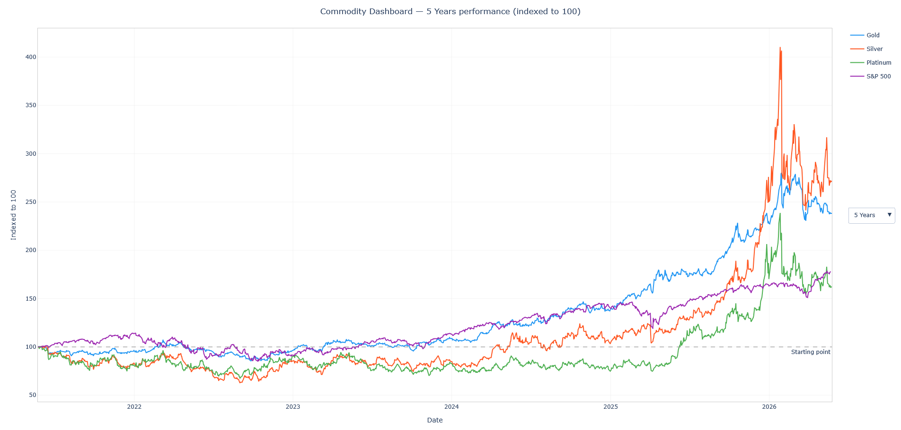

# Commodity Dashboard

An interactive dashboard to compare the performance of precious metals and the S&P 500 over time — no installation required.

**[View live dashboard](https://alejandrotendero.github.io/commodity-dashboard/normalized.html)**



---

## What it shows

All assets are normalized to a base of 100 at the start of the selected period. This makes it easy to compare percentage growth across assets with very different price levels — the chart answers the question: *if you had invested $100 in each asset at the start of this period, where would you be today?*

| Asset | Ticker | Type |
|-------|--------|------|
| Gold | GC=F | Continuous futures |
| Silver | SI=F | Continuous futures |
| Platinum | PL=F | Continuous futures |
| S&P 500 | ^GSPC | Index |

**Available periods:** 1 Month · 6 Months · 1 Year · 2 Years · 5 Years · 10 Years

---

## How it works

The chart is a self-contained HTML file generated by Python and published via GitHub Pages. There is no server — all interactivity (period switching, hover, zoom) runs client-side through Plotly's JavaScript engine embedded in the file.

```
fetcher.py        → downloads data from Yahoo Finance (yfinance)
normalized.py     → builds the interactive Plotly chart
main.py           → orchestrates the pipeline and writes the HTML
docs/             → output folder served by GitHub Pages
```

---

## Run it locally

```bash
git clone https://github.com/AlejandroTendero/commodity-dashboard.git
cd commodity-dashboard

conda create -n commodity-dashboard python=3.11
conda activate commodity-dashboard
pip install -r requirements.txt

python main.py
```

Then open `docs/normalized.html` in your browser.

---

## Roadmap

- [ ] Correlation heatmap between assets
- [ ] Drawdown chart
- [ ] Rolling volatility
- [ ] Migrate to Streamlit for richer interactivity and KPIs

---

## Disclaimer

This dashboard is for informational purposes only and does not constitute financial advice. Data sourced from Yahoo Finance via yfinance.
